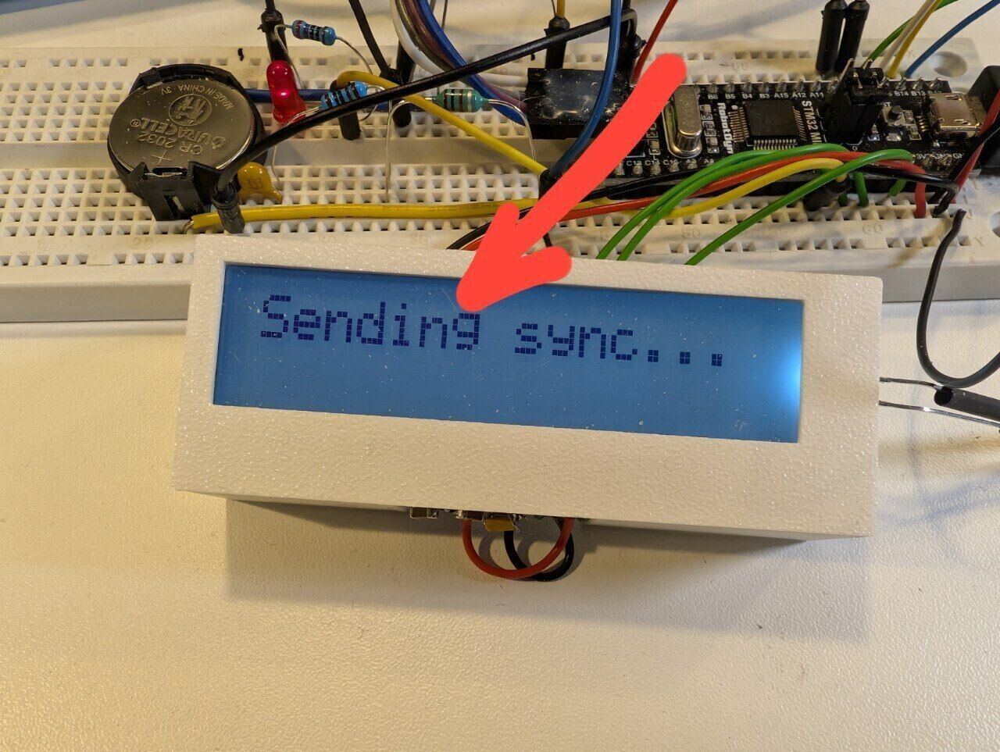

# 5×N

A custom fix for the ST7032-0D typeface. This font addresses font issue with letter `g` , adding a distinctive 5×N character feel

## Variants

The typeface comes in two grid variants:
- **5x8** - Standard compact version
- **5x10** - Extended version with additional vertical space

## Features

- Modified character forms for improved legibility
- Optimized for small displays and embedded systems
- Designed for for ST7032-0D systems, meaning that on any regular display will look veeeeery small (i mean like extremely small)
- Available in both 5x8 and 5x10 grid configurations