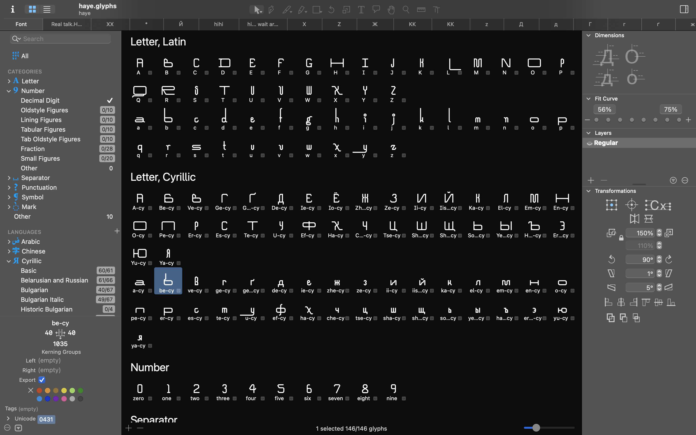

# Haye

An experimental modular typeface that creates a wild fusion between arabesque elements and grotesque structural foundations.

## Features

- Unique hybrid design blending arabesque decorative elements with grotesque sans-serif structure
- Includes basic Latin and Cyrillic character sets along with numerals
- Experimental approach to letterform construction

## Character Sets

- Latin alphabet (basic)
- Cyrillic alphabet (basic)
- Numerals (0-9)

## Future Development

Currently in development with plans to implement a variable font format featuring:
- 3-point variation axis system
- Customizable balance between arabesque and grotesque elements

