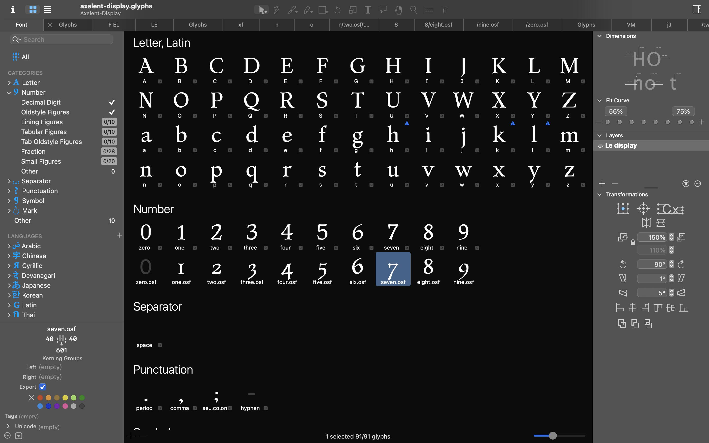
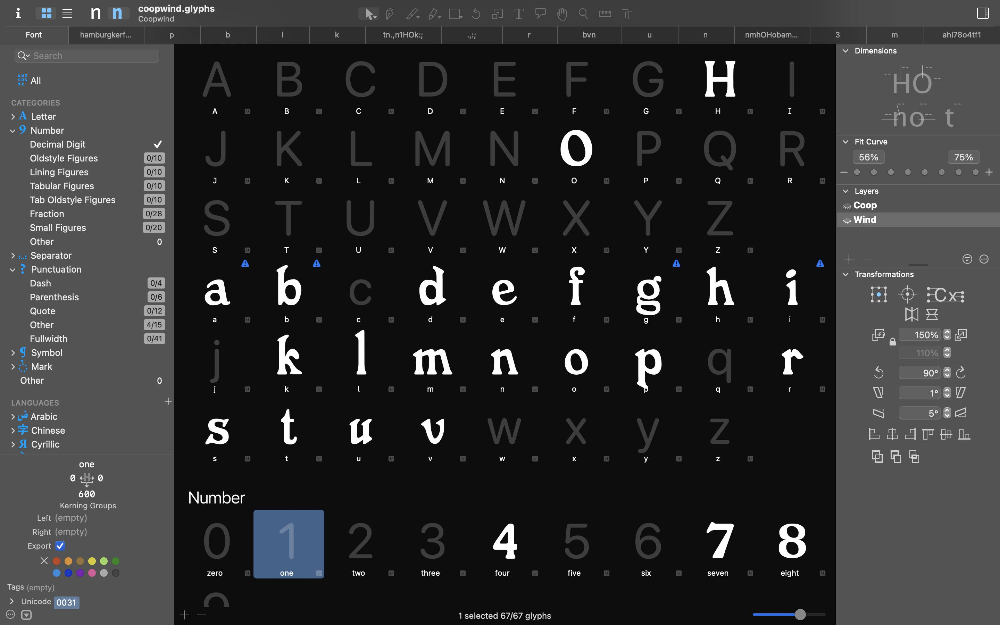
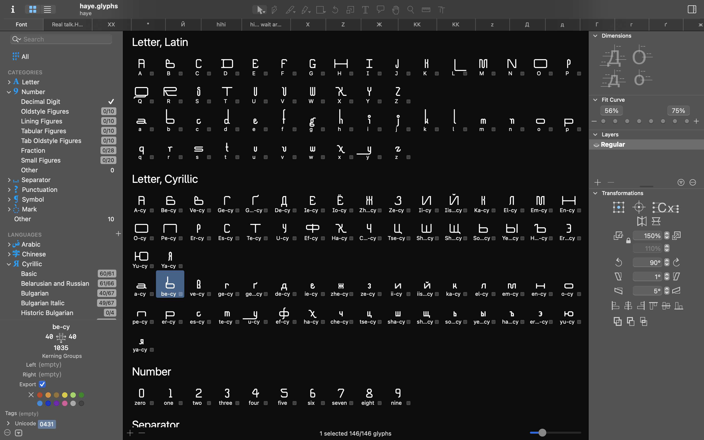

# Les Typefaces

A collection of typefaces designed by me. Everything is work in progress, dont judge

## Typefaces

### Navajo

[Navajo](navajo/) - Revival of a sign on a shop window in The Hague

### 5xN

[5×N](5xN/) - Fix for default ST7032-0D typeface

### Axelent

[Axelent](axelent/) - A "translation" typeface featuring brutal cuts for display usage

### Todidel

[Todidel](todidel/) - An expansion typeface inspired by Didot with a reversed name

### Wooper

[Wooper](wooper/) - Fast food inspired typeface with bold, rounded forms. Dont take this one seriously

### Haye

[Haye](haye/) - Experimental modular typeface fusing arabesque and grotesque elements

## License
All this is licensed under the terms of the [DWTFYWTPL](https://en.wikipedia.org/wiki/WTFPL)

<!-- all typefaces are still under development -->