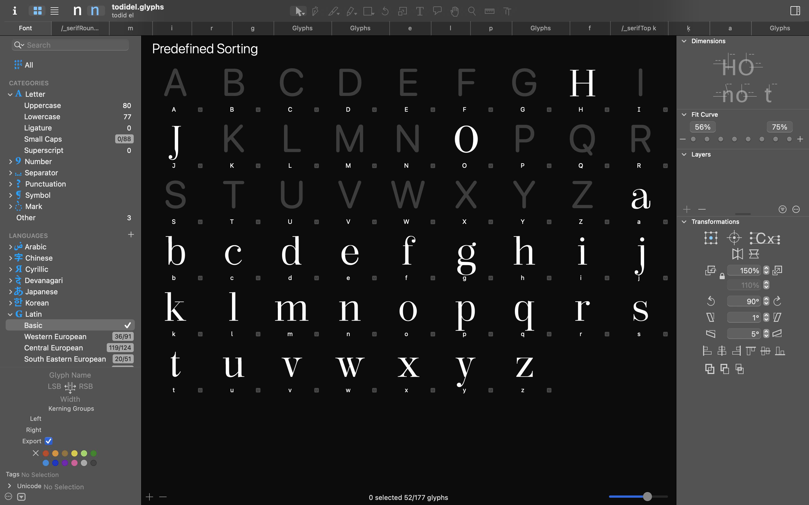

# Todidel

An expansion typeface with a playful name — "Todidel" is "le didot" read in reverse—honoring the classic French typeface while reimagining it for contemporary use.

## Features

- Maintains the elegant high contrast between thick and thin strokes
- Refined serifs that pay homage to the historical design

## History

This revival builds upon the foundation laid by the Didot family of typefaces, originally developed in the late 18th and early 19th centuries by Firmin Didot. The modern interpretation preserves the distinctive vertical stress and crisp features while introducing subtle adaptations for today's design needs.

<!-- todidel works best at larger sizes where the contrast between thick and thin strokes can be fully appreciated -->