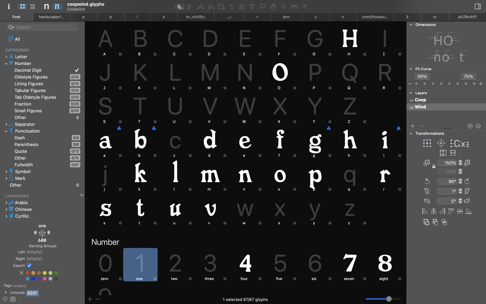
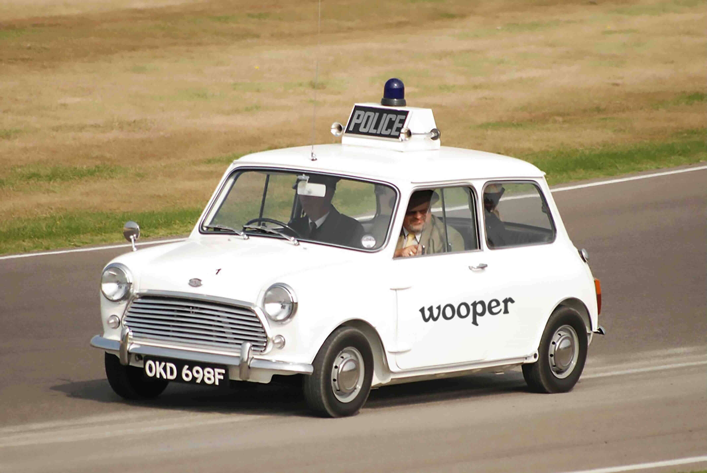

# Wooper

A fast food inspired typeface that embodies the quick and fat aesthetics of diner signage and burger joint menus. While it didn't quite meet my original vision, I somewhat like this ugly guy

## Features

- Variable
- Bold, rounded forms reminiscent of fast food branding
- Slightly imperfect character shapes that maintain a handmade quality

## The Spirit

The typeface attempts to capture the approachable, unpretentious nature of fast food typography, balancing between playfulness and legibility.

<!-- this typeface was an experiment that turned out differently than expected, but still has some charm to it -->